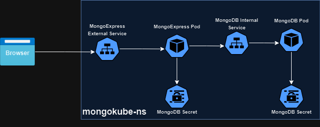

# mongokube
MongoKube is a framework that is developed to use custom resources for automating the deployment of MongoDB on Kubernetes cluster.

### MongoDB and MongoExpress
MongoDB, known for its flexibility and scalability, is a non-relational database offering a document-oriented solution. It is often paired with MongoExpress, a web-based administrative interface simplifying MongoDB database management.

When deploying MongoDB on a Kubernetes cluster, users typically engage in manual and time-consuming tasks—setting up MongoDB deployments, internal and external services, secrets, and configMaps individually.

MongoKube aims to eliminate this manual effort by automating the entire MongoDB deployment process through a few simple commands. Users can effortlessly create a YAML file defining Mk custom resource specifications and execute a single command to initiate the complete MongoDB deployment (including deployments, external and internal services, service and config maps) process on cluster. This power of custom resources along with custom controller has enabled the fast provisioning and orchestration of MongoDB.

### Architecture of mongokube

Whenever a Mk resource is created, following resources are created and communicated to each other;



### Creating a mongokube resource (Deployment on Minikube Cluster)
*Pre-req : Make sure minikube cluster is up and running properly.*

Firstly, create a separate namespace for mongokube, run;
```
kubectl create namespace mongokube-ns
```

To create the CRD for mongokube, run;
```
kubectl create -f home/$(whoami)/mongokube/manifests/mongokube-crd.yaml
```

Start the controller from project's root directory in one terminal window;
```
go run main.go
```

To create a Mk custom resource, run the following command on second terminal window;
```
kubect  create -f ./manifests/mongo.yaml
```

To see how to create yaml file (like mongo.yaml), please refer to [design](./docs/design.md) and [manifests](./manifests/mongo.yaml)

## Related Medium Blogs
- [MongoKube — Simplifying MongoDB Deployment on Kubernetes Cluster](https://uhabiba.medium.com/mongokube-simplifying-mongodb-deployment-on-kubernetes-cluster-c5b4de9ab3e4)
- [Kubernetes Maestro: Power of Custom Resources for Next-Level Orchestration](https://uhabiba.medium.com/kubernetes-maestro-power-of-custom-resources-for-next-level-orchestration-908cec883e3f)


### References
- https://kubernetes.io/docs/tasks/extend-kubernetes/custom-resources/custom-resource-definitions/
- https://github.com/kubernetes/sample-controller
